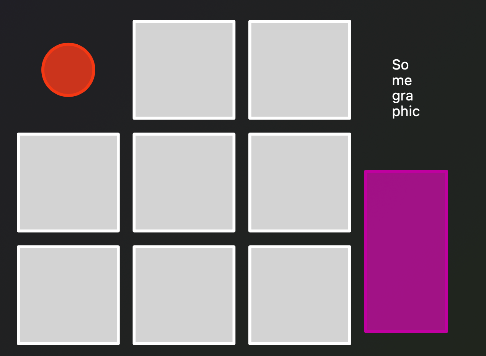
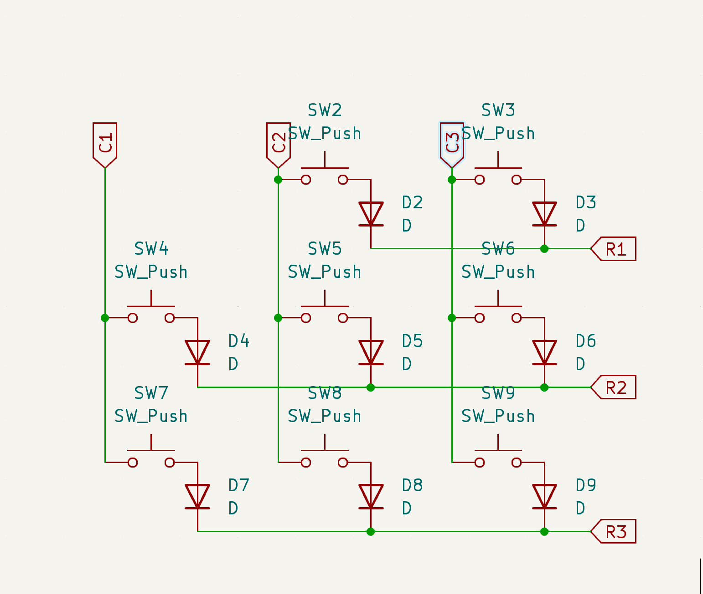

## 24 May

rough outline of what the layout will look like 
- the keycaps in white
- encoder at the top left
- microcontroller on the right
- i think i'll put a graphic onto the pcb silkcreen in the empty space
**Board Selection**
- able to be used wirelessly and wired
- enough pins for all switches
i took a look at zmk firmware, mainly used for wireless keyboards
the nice_nano that uses NRF52840 seems suitable and is widely avaible on aliexpress
zmk also supports encoders
**Switches and Keycaps**
i'll likely use a varient of the low profile kailh choc switches and keycaps
### begin the PCB
watched a video on how to setup the footprint and symbols in kicad
made the key matrix of 3x3 (minus the 1) 

**Time Spent:** 2hrs

## 26 May
### Built the Firmware
edited the romac keyboard template to fit the 3x3 layout with some basic letter keys
**Time Spent**
30mins